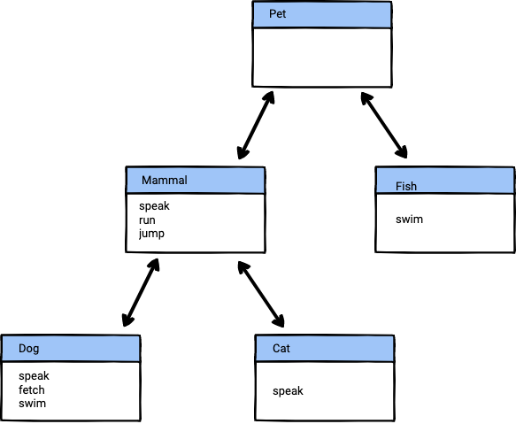

# Mix-Ins

A limitation of class inheritance in many languages is that classes can only subclass directly from one superclass. We call this single inheritance. Python, on the other hand, supports multiple inheritance: classes can subclass as many superclasses as needed.

This isn't necessarily good news. **Multiple inheritance** (MI) is fraught with pitfalls, and should normally be left to the domain of expert programmers. In practice, MI is rarely needed. If you think you need MI, you may need to reconsider your design choices.

As far as most beginners are concerned, you can think of Python and other MI languages as supporting only **single inheritance** (SI).

Using SI, though, imposes limitations on what you can do to accurately model a problem domain. For instance, suppose we want to add a `Fish` class to the following class hierarchy:

```python
class Pet:
    def speak(self):
        pass

    def run(self):
        return 'running!'

    def jump(self):
        return 'jumping!'

class Dog(Pet):
    def speak(self):
        return 'bark!'

    def fetch(self):
        return 'fetching!'

    def swim(self):
        return 'swimming!'

class Cat(Pet):
    def speak(self):
        return 'meow!'

```

Note that the `Pet` class has `speak`, `run`, and `jump` methods.

Fish can swim, live in a small bowl, eat, etc. However, they can't speak, run, or jump. (Okay, they can sometimes jump, but that's not always a wise life choice by the fish. We'll pretend they can't jump.) Given this information, we need to reorganize our classes and methods in the Pet class:

[](image.png)

This seems fine, except we have swim in both the `Dog` class as well as the `Fish` class. We'd like to not have the same swim method in two different classes, but where do we move it?

With MI, we could conceivably create a `SwimmingAnimal` class that both `Fish` and `Dog` could inherit from in addition to inheriting from `Pet` or `Mammals`. However, we want to avoid MI. Fortunately, there's a better solution: use a **mix-in** instead.

Mix-ins are an application of MI that is very useful in Python. It lets us create classes that can be mixed in to other classes. They provide the means to reuse code in multiple classes, even classes that are unrelated. This is also known as interface inheritance. We're using mix-ins to share behavior instead of super classes, so we're inheriting an interface.

It's important to note that mix-ins don't follow any special mixin-specific rules. As far as Python is concerned, mix-ins are just multiple inheritance. We, as programmers, create a set of guidelines to follow so that we can avoid the complexities of MI while still being able to share behavior across classes when a simple hierarchy doesn't suffice.

Mix-ins have the following characteristics:

* Mix-ins are usually small and focused, providing a single piece of functionality. Several methods may be involved, but they are all focused on the same basic functionality.
* Mix-ins should not normally have state of their own. In particular, they don't have a __init__ method.
* Mix-ins must not be instantiated. In Python, all classes can be instantiated, including mix-ins, but you should not do so. In particular, the lack of state makes instantiation questionable. Furthermore, instantiating mix-ins suggests that the mix-in is unsuitable to act as a mix-in.
* Mix-ins must not be dependent on the inner workings of other classes.
* Mix-ins should be reusable in multiple classes.
* A class should usually only subclass from one superclass. However, you can use as many mix-ins as you like.

Let's update our code to use a SwimMixin mix-in class (the Mixin suffix for the class name is the conventional way to name mix-in classes).

```python
class SwimMixin:
    def swim(self):
        return 'swimming!'

class Pet:
    def speak(self):
        pass

    # run and jump methods moved to Mammal class

class Mammal(Pet):
    def run(self):
        return 'running!'

    def jump(self):
        return 'jumping!'

class Fish(SwimMixin, Pet):
    pass

class Dog(SwimMixin, Mammal):

    def speak(self):
        return 'bark!'

    def fetch(self):
        return 'fetching!'

    # swim method moved to SwimMixin

class Cat(Mammal):

    def speak(self):
        return 'meow!'
```

The result is that the swim method from `SwimMixin` is available in both the `Dog` and `Fish` class. Using interface inheritance, it's as though we copied and pasted the swim method into those classes. We can mix in as many mix-ins as we want. Mixing in mix-ins, though, does affect the method lookup path. Use the mro method to see how mixing in various mix-ins affects how Python looks up methods.

Note that mix-ins are usually listed before the superclass in the inheritance list in the class definition. While this isn't a requirement for mix-ins, it's good practice. Recall that the items in an inheritance list are processed left to right in the MRO, and you usually want to search the mix-ins before you search the superclass.

Question:

**Do mix-ins follow different MRO rules than regular classes? Why or why not?**

No. Mix-ins follow the same MRO rules as any regular class because, to Python, mix-ins are just classes participating in multiple inheritance. There are no special, mixin-specific rules. The method lookup follows the standard MRO, which processes base classes left to right—so you typically list mix-ins before the main superclass to have their methods found first. 
